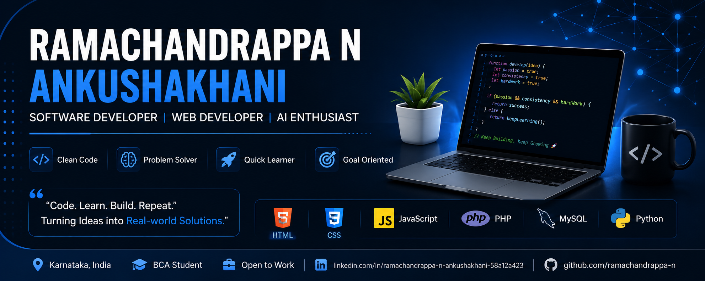

  

# Hi there 👋, I'm Ramachandrappa N Ankushakhani

## 💫 About Me

🎓 Bachelor of Computer Applications (BCA) Student

💻 Aspiring Software Developer

🤖 Passionate about Software Development, Web Development, and Artificial Intelligence.

🌱 Currently learning Full Stack Web Development

🚀 Looking for Internship & Entry-Level Software Developer opportunities

---

## 💻 Tech Stack

- HTML
- CSS
- JavaScript
- PHP
- MySQL
- Python
- Java
- C

---

## 🚀 Current Project

### AI-Based Smart Farmer Support System

Developed an AI-powered web application that recommends suitable crops using weather data, soil analysis, and location information.

Technologies: HTML, CSS, JavaScript, PHP, MySQL.

---

## 📫 Connect with Me

- LinkedIn: www.linkedin.com/in/ramachandrappa-n-ankushakhani-58a12a423

---

⭐ Thanks for visiting my profile!
